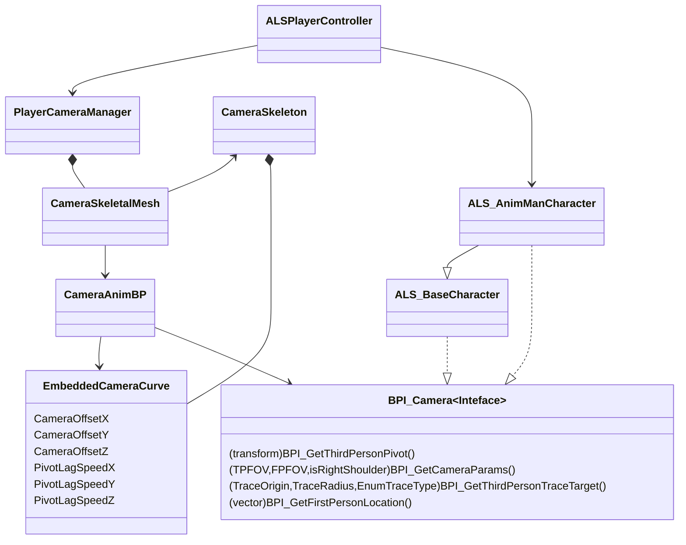

参考一下这个网站：
https://ue5study.com/unrealengine-physics/#toc8
上面有大量先进技术的介绍和实现

摄像机系统
ALSPlayerController、ALSPlayerCameraManager、ALSCameraBP、CharacterBP之间要进行耦合。

目标是要让CharacterBP能被Camera
ALSPlayerController -> ALSPlayerCameraManager -> CameraBP

ALSPlayerController是最顶层的，它直接引用PlayerCameraManager，从PlayerController事件触发，事件控制时将它所拥有的Character或者说Pawn传给PlayerCameraManager，然后PlayerCameraManager将其赋予给CameraAnimBP。最终目的是要在CameraBP上拿到Character引用，并调用其接口。

# Event Basic

## Event callflow

重要事件的执行顺序流
关卡加载
   ↓
Actor Constructor（C++ 构造函数或蓝图构造事件）
   ↓
Component Constructor
   ↓
所有 Component BeginPlay
   ↓
Actor BeginPlay
   ↓
GameMode / PlayerController BeginPlay（如果存在）
   ↓
PlayerController Possess Pawn（Pawn BeginPlay 已触发）
   ↓
每一帧：
    PlayerController Tick
    → Pawn Tick
       → Component Tick

BeginPlay (关卡开始)
   ↓
GameMode → 获取 PlayerController
   ↓
GameMode → 查找 PlayerStart
   ↓
GameMode → Spawn DefaultPawn at PlayerStart
   ↓
PlayerController → Possess(DefaultPawn)
   ↓
PlayerCameraManager → ViewTarget = DefaultPawn

# 蓝图系统

## 蓝图通信
这部分请参考xxx

## 蓝图节点积累
### 旋转向量
首先要明白一点，UE5是左手坐标系，前方是x轴，右侧是Y轴，上方是z轴。如此一来顺时针旋转就是正旋转。
unrotate vector 意思是反旋转，你说要正旋转90°，它实际效果是反旋转90°
rotate vector这个则是正常的旋转，正是正，反是反。

### 插值
鉴于运动这一块实在过多的插值部分内容和知识了，需要特别学习。

## 运动学

控制器控制移动方向、力度控制速度大小

每帧速度以及加速度的设置，获取速度的旋转角度/加速度的旋转角度。
以及判断角色是否正在移动。

第一步是创建枚举类或者说状态类，这些状态之间是有层次的。需要非常了解
1.枚举类创建 状态栏

ALS_Gait
- Walking
- Running
- Sprinting

ALS_MovementAction
 - None
 - LowMantle
 - HighMantle
 - Rolling
 - Getting up 

ALS_MovementState
- None
- Grounded
- in Air
- Mantling
- Ragdoll

ALS_OverlayState 
- aim
- ...
以上可以做一些个性化的改变，在原有行为上叠加。

ALS_RotationMode
- VelocityDirection
- LookingDirection
- AimDirection

ALS_Stance
- Standing
- Crouching

ALS_ViewMode
- FirstPerson
- ThirdPerson

2.写接口
###  CharacterInfo

#### BPI_GetCurrentState
Input
Output：

#### BPI_GetEssentialValues
Input：
None
Output：
Velocity：Vector
速度矢量
Acceleration：Vector
加速度
MovementState：Vector
移动状态
IsMoving：Boolean
是否移动
HasMovingInput：Boolean
是否有移动输入
Speed：Float
速度标量
MovementInputAmount：Float
移动输入强度
AimingRotation：Rotator
控制旋转角度
AimYawRate：Float

以上接口有Character蓝图实现，因为Character中带有MovementComponent。

Speed是一个标量，Velocity是矢量
Speed一般用于判断是否移动
ALSv4里AimmingRotation和控制器旋转其实是一回事

通过Character蓝图获取Player输入的信息得到一系列参数如Speed、AimRotation等等用于给动画蓝图输出动画做参考。
动画蓝图需要与角色蓝图通信，角色蓝图实现上面两个接口提供给动画蓝图获取信息。

摄像机系统：

人物动作系统架构：
Character BluePrint  简称ChBP吧
Character AnimBP 简称ChAnimBP

ChBP基于MovementComponent以及MovementInput得到Speed、AimRotation、MovementInput、Acceleration等参数并将其通过接口输出。
动画蓝图通过调用接口得到这些信息做进一步的动画处理。

从而让动画蓝图接收到Input信息来处理动画的逻辑展示动画出来。
各个枚举值只是为了来层层嵌套

通过宏函数和Set事件来统一处理各种枚举的设置。
方便后续调用。

配置各个结构体，然后配置数据表，数据表类似结构体数组。里面每一行其实就是一个结构体实例。

配置各种东西完成动画蓝图获取基本信息，为六向状态机铺垫。
1.包括步态的速度等处理Movemnet的逻辑
2.

1.学习Animation Layer的应用
2.搞懂曲线是怎么渗透应用到系统里去调节动画的。
3.搞懂Stride、PlayRate、Speed这三者之间的关系。
4.搞懂Rotation的使用，角色如何旋转。
5.搞懂六向状态机的原理，思想。

$$
freq = \frac{Lerp(\frac{||v||}{||v||_{Walk}},\frac{||v||}{||v||_{Run}}, w_{Gait})}{\alpha_{Stride}}
$$

## 走跑混合

1、如何防止滑步？
为何会出现滑步现象？
每个动画都会有一个动画所展示出来的固有速度，比如行走，那么它这个行走动画就会因步幅和步频而得到一个速度。速度大致是关于步幅和步频的一个函数。 步幅就是步幅，而步频可以根据动画播放速率来表征。
因为我们使用的不是一个单一的动画而是一个混合空间，所以我们需要的是混合空间在某点上的固有速率以及对其匹配的播放速率。当播放速率和当前混合空间所表征的固有速率匹配不了当前速度时就会出现滑步现象。
混合空间横坐标代表步幅，按照ALSv4的方式混合，确实可以调节步幅

可以写一个关系出来。
我们假设
$$ 
v_{walk}：行走动画的固有速率\\
v_{blend}: 混合空间在某点播放的混合动画的固有速率\\
s:步幅\\
v: 移动部件此时的速度\\
freq: 此时的匹配动画播放速率
$$
因为混合空间起始点是行走动画的开始姿势因此固有速率为0，而终点是行走动画本身
因此如果不考虑走跑混合，行走的随s变化混合的固有速率是$s*v_{walk}$
因此此时匹配的播放速率有如下关系：

$$
freq = \frac{v}{s*v_{walk}}
$$

表现为速度除以行走动画速度之后再除以步幅归一化参数。

说实话这一段程序解读依然是很有挑战的，不是那么容易。尤其是计算混合状态，过渡插值

设 BlendSpace 的采样点权重按双线性插值（bilinear）分配，参数为 x∈[0,1]x\in[0,1]x∈[0,1]（stride 轴），y∈[0,1]y\in[0,1]y∈[0,1]（walk↔run 轴）。四个角的权重为：

$$
w_{00}=(1−x)(1−y),WalkPose（单帧，固有速率 0）
$$
$$
w_{10}=x(1−y), Walk（固有速率 v_{walk}​）
$$
$$
w_{01}=(1−x)y, — RunPose（单帧，固有速率 0）
$$    
$$
w_{11}=xy, — Run（固有速率 v_{run}​）
$$
    

    

因此**混合后的固有速率**（动画本身在该点的“自然播放速率”）为这四个采样速率的加权和：
$$
v_{\text{blend}} = w_{00}\cdot 0 + w_{10}\cdot v_{walk} + w_{01}\cdot 0 + w_{11}\cdot v_{run} = x(1-y)\,v_{walk} + x y  v_{run}
$$
可以进一步写成更直观的形式：
$$
vblend=x⋅((1−y) vwalk+y vrun)=x⋅lerp(vwalk, vrun, y).v_{\text{blend}} = x \cdot \big( (1-y)\,v_{walk} + y\,v_{run} \big) = x \cdot \mathrm{lerp}(v_{walk},\,v_{run},\,y).vblend​=x⋅((1−y)vwalk​+yvrun​)=x⋅lerp(vwalk​,vrun​,y).
$$

Anim Montage没有播放的原因
1.Slot名称要对应上
2.要有播放Slot
3.PlaySlotAnimationAsDynamicMontage
4.似乎是有一个参数忘记初始化，导致无法播放，PlayRate这个参数。
5.然后旋转过程需要记录得到动画实际的旋转角度。

精妙设计包括：六向状态机、停止和开始移动的转移承接、原地旋转设计。每一个都让人惊叹！！！后面还有IK锁定脚部，让启停更加牛，攀爬系统，Overlay系统，可扩展的系统。关键是控制性扩展性超级强，Motion Matching达不到，只能说幸好认真学习了ALSv4，虽然过程略显枯燥，但真的回味无穷。而且GASP的作者设计了一种系统，仅用1/3左右Motion Matching的动画就达到了接近Motion Matching的流畅度，这也是值得考虑尝试的。后面自己再在理解ALSv4的基础上再次重构一下。理解虚拟骨骼的基础上，直接做一套Genesis 9骨骼为基础的ALS，不需要重定向，来提升一下性能。

Locomotion搞完，下一步可以尝试一下AI系统。让AI无缝衔接到这套ALS上面，这样就达到目的了。我希望能够做到玩家和AI共用一套表现层逻辑

输入层(玩家输入，AI决策输出)->逻辑层(转换成Movement Component的行动)->

最精妙的莫过于通过Feet_Position曲线来确定具体使用哪一个跳跃动画，左脚和右脚起跳？这个设计确实让人眼前一亮。
这种设计理念来自于： 最了解动画的是动画本身。因此只要我们通过动画标出一些关键的信息，并通过曲线或者事件通知的方式给出的话，就可以做出非常精细的动画了。

下一步是攀爬系统。如果攀爬系统解决了的话，还有IK、脚步锁定。
话说Feet Crossing这种细微的东西都考虑到的ALSv4确实不俗。但是原版ALSv4为什么无法用于多人网络呢？

起跑，包括人物倾斜动画，它是通过Detail状态机来完成。配合Additive完成的。
多学习一下这种分层式的动画设计，这样Idle动作以及脸部动画都是可以分开完成了。
尤其是Idle动画，Hip以下和Hip以上完全可以分开了。通过一套状态机来完成一个较为复杂的Idle，然后Idle过程如果出现状态变换即从Not Moving变换到Moving就要设计一套转移Transition机制，让其看起来不那么僵硬。
既然脚部落地和离开可以用曲线提供信息，并根据这个信息完成不同动画，那其他部位也完全可以。
现在# 六向状态机
其实六向状态机并没有太大的难度，主要是要根据VelocityBlend来获取各个方向的一个比例。这个可以参考这个数据计算的函数。主要使用L1范数来强制各个分量之和为1。

然后是转移条件，这里可以学到很多**共享组**的使用方法。

## 人物偏移Lean的使用和计算

> Written with [StackEdit](https://stackedit.io/).
<!--stackedit_data:
eyJoaXN0b3J5IjpbMTY1NTkxMjQ1OV19
-->