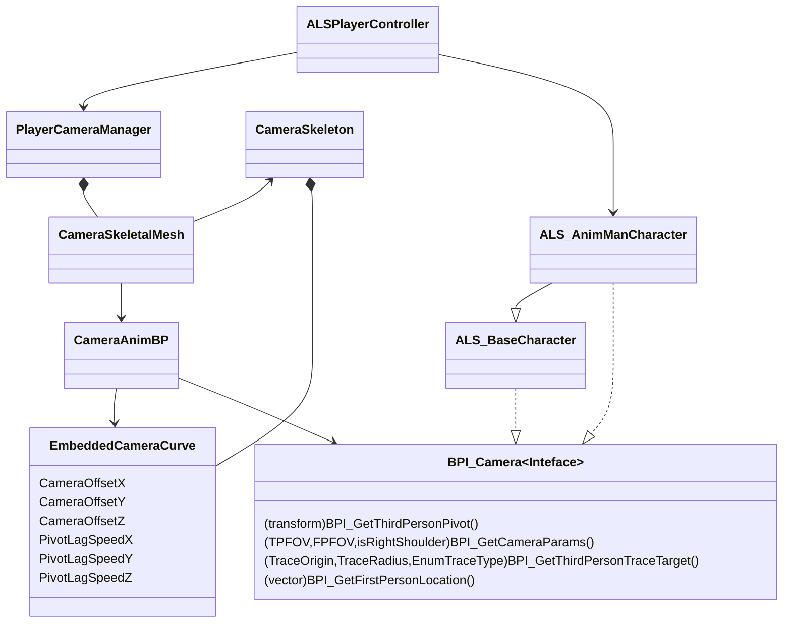

参考一下这个网站：
https://ue5study.com/unrealengine-physics/#toc8
上面有大量先进技术的介绍和实现

摄像机系统
ALSPlayerController、ALSPlayerCameraManager、ALSCameraBP、CharacterBP之间要进行耦合。

目标是要让CharacterBP能被Camera
ALSPlayerController -> ALSPlayerCameraManager -> CameraBP

ALSPlayerController是最顶层的，它直接引用PlayerCameraManager，从PlayerController事件触发，事件控制时将它所拥有的Character或者说Pawn传给PlayerCameraManager，然后PlayerCameraManager将其赋予给CameraAnimBP。最终目的是要在CameraBP上拿到Character引用，并调用其接口。

# Event Basic

## Event callflow

重要事件的执行顺序流
关卡加载
   ↓
Actor Constructor（C++ 构造函数或蓝图构造事件）
   ↓
Component Constructor
   ↓
所有 Component BeginPlay
   ↓
Actor BeginPlay
   ↓
GameMode / PlayerController BeginPlay（如果存在）
   ↓
PlayerController Possess Pawn（Pawn BeginPlay 已触发）
   ↓
每一帧：
    PlayerController Tick
    → Pawn Tick
       → Component Tick

BeginPlay (关卡开始)
   ↓
GameMode → 获取 PlayerController
   ↓
GameMode → 查找 PlayerStart
   ↓
GameMode → Spawn DefaultPawn at PlayerStart
   ↓
PlayerController → Possess(DefaultPawn)
   ↓
PlayerCameraManager → ViewTarget = DefaultPawn

# 蓝图系统

## 蓝图通信
这部分请参考xxx

## 蓝图节点积累
### 旋转向量
首先要明白一点，UE5是左手坐标系，前方是x轴，右侧是Y轴，上方是z轴。如此一来顺时针旋转就是正旋转。
unrotate vector 意思是反旋转，你说要正旋转90°，它实际效果是反旋转90°
rotate vector这个则是正常的旋转，正是正，反是反。

### 插值
鉴于运动这一块实在过多的插值部分内容和知识了，需要特别学习。

## 运动学

控制器控制移动方向、力度控制速度大小

每帧速度以及加速度的设置，获取速度的旋转角度/加速度的旋转角度。
以及判断角色是否正在移动。

第一步是创建枚举类或者说状态类，这些状态之间是有层次的。需要非常了解
1.枚举类创建 状态栏

ALS_Gait
- Walking
- Running
- Sprinting

ALS_MovementAction
 - None
 - LowMantle
 - HighMantle
 - Rolling
 - Getting up 

ALS_MovementState
- None
- Grounded
- in Air
- Mantling
- Ragdoll

ALS_OverlayState 
- aim
- ...
以上可以做一些个性化的改变，在原有行为上叠加。

ALS_RotationMode
- VelocityDirection
- LookingDirection
- AimDirection

ALS_Stance
- Standing
- Crouching

ALS_ViewMode
- FirstPerson
- ThirdPerson

2.写接口
###  CharacterInfo

#### BPI_GetCurrentState
Input
Output：

#### BPI_GetEssentialValues
Input：
None
Output：
Velocity：Vector
速度矢量
Acceleration：Vector
加速度
MovementState：Vector
移动状态
IsMoving：Boolean
是否移动
HasMovingInput：Boolean
是否有移动输入
Speed：Float
速度标量
MovementInputAmount：Float
移动输入强度
AimingRotation：Rotator
控制旋转角度
AimYawRate：Float

以上接口有Character蓝图实现，因为Character中带有MovementComponent。

Speed是一个标量，Velocity是矢量
Speed一般用于判断是否移动
ALSv4里AimmingRotation和控制器旋转其实是一回事

通过Character蓝图获取Player输入的信息得到一系列参数如Speed、AimRotation等等用于给动画蓝图输出动画做参考。
动画蓝图需要与角色蓝图通信，角色蓝图实现上面两个接口提供给动画蓝图获取信息。

摄像机系统：

人物动作系统架构：
Character BluePrint  jian
Character AnimBP

> Written with [StackEdit](https://stackedit.io/).
<!--stackedit_data:
eyJoaXN0b3J5IjpbMTQ5OTQyMTA1LDU0Mjk1ODMzOSwtMTkzMT
UzNzQ5MywtMjUwNzA0NDkwLC0xNDc2OTUzOTUyLC00NzI1MDI4
MDUsNjYzOTgzODMwLC0xODIzMTAyNzY3LDE4ODQwMTUxNzAsLT
EyMzI1NjY5MywtMTk2NTUwNDE5MSwxMzU4Mzc0ODU2LDE4MTM4
NDQ5ODYsLTE4MzU4MzgxMzcsLTYyOTMyMjA2NCw4MTgwNDc4NT
gsOTU0Mjc4ODkyLC0xMDQ2OTg4MDU0XX0=
-->