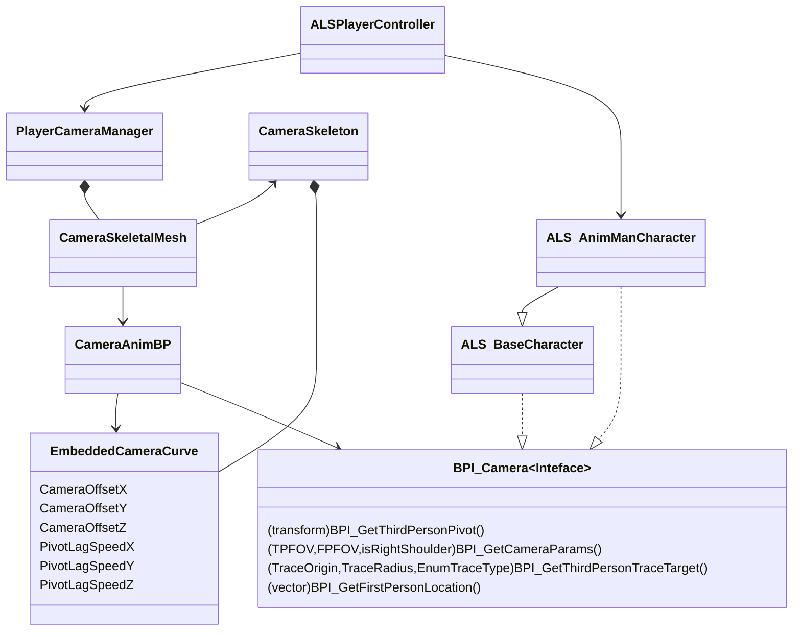

参考一下这个网站：
https://ue5study.com/unrealengine-physics/#toc8
上面有大量先进技术的介绍和实现

摄像机系统
ALSPlayerController、ALSPlayerCameraManager、ALSCameraBP、CharacterBP之间要进行耦合。

目标是要让CharacterBP能被Camera
ALSPlayerCamera

ALSPlayerController是最顶层的，它直接引用PlayerCameraManager，从PlayerController事件触发，事件控制时将它所拥有的Character或者说Pawn传给PlayerCameraManager，然后PlayerCameraManager将其赋予给CameraAnimBP。最终目的是要在CameraBP上拿到Character，并调用其接口。

> Written with [StackEdit](https://stackedit.io/).
<!--stackedit_data:
eyJoaXN0b3J5IjpbMTM1MTUwOTA4Niw5NTQyNzg4OTIsLTEwND
Y5ODgwNTRdfQ==
-->