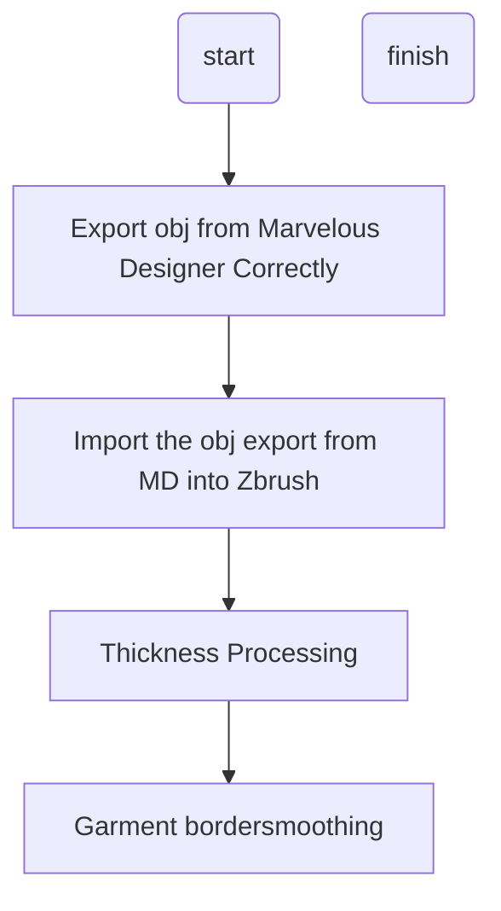

# Preface

```mermaid
flowchart
	st(start)
	mdexport[Export obj from Marvelous Designer Correctly]
	zbimport[Import the obj export from MD into Zbrush]
	ed(finish)
	
	thickness[Thickness Processing]
	bordersmooth[Garment bordersmoothing]
	st-->mdexport-->zbimport-->thickness-->bordersmooth
	


```

> Written with [StackEdit](https://stackedit.io/).
<!--stackedit_data:
eyJoaXN0b3J5IjpbMTc2OTgwMjY4LC02NjAwNTMyMDAsMTE3OD
MyODI2M119
-->